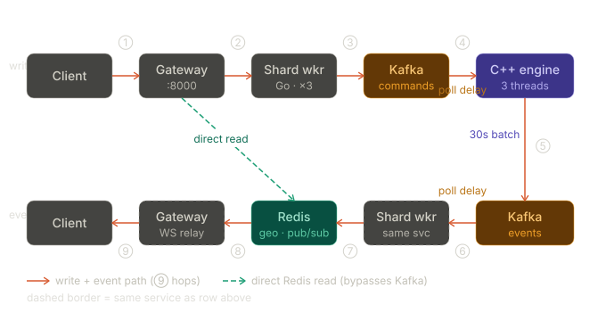
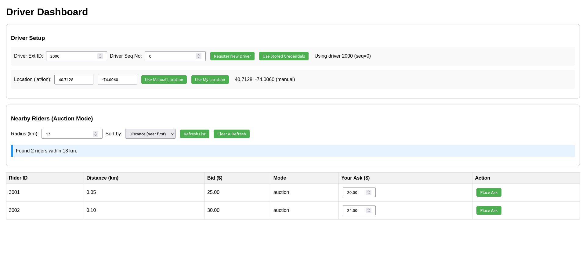

# Auction-Based Ride Matching Engine



## Motivation

Uber and similar platforms centralize price determination, typically using ML models to set a "surge" price. This has two problems:

1. **The price can be out of touch with real market conditions** — it's an estimate, not a discovered price.
2. **It's expensive to compute** — large ML inference pipelines run on every request.

This ride matching system experiments with a different model: **a decentralized auction market** where drivers and riders post their own prices. The idea is borrowed from financial markets — let supply and demand discover the price rather than predict it.

The two core auction mechanisms are:

- **Instant Match** — a first-come, first-served model where a rider posts a bid and the first nearby driver to accept takes it at that price.
- **Auction Market** — drivers express interest in nearby riders by posting an ask. The rider is matched to the lowest-ask driver at the *second-lowest ask price* (a Vickrey / second-price auction), which gives drivers an incentive to bid their true cost rather than game the system.

The tradeoff vs. centralized pricing is **liquidity risk** — if not enough participants are active, matches don't happen. A future simulator will test different matching algorithms, UI indicators, and parameter choices to explore this tradeoff.

---

## Driver UI

The driver dashboard allows drivers to see nearby auction riders, sort by distance or bid, and place asks.  


## High-Level Architecture

```
  Client (HTTP / WebSocket)
         │
         ▼
   ┌─────────────┐
   │  Go Gateway │  :8000  — routes requests, serves WebSocket push notifications
   └──────┬──────┘
          │  HTTP (per-shard routing)
          ▼
   ┌─────────────────────────────────┐
   │  Go Shard Workers (×3)          │  :8080, :8081, :8082
   │  — produce Kafka commands       │
   │  — consume Kafka events         │
   │  — update Redis state           │
   └──────────────┬──────────────────┘
                  │  Kafka  (commands topic, events topic)
                  ▼
   ┌─────────────────────────────────┐
   │  C++ Matching Engines (×3)      │  one per shard
   │  — consume commands             │
   │  — run matching logic           │
   │  — produce events               │
   └─────────────────────────────────┘

   ┌─────────┐
   │  Redis  │  — rider/driver metadata, geo-index, pub/sub for push notifications
   └─────────┘
```

There are **3 shards**. A rider or driver is assigned to a shard based on their geographic location using the **H3 geospatial index** (resolution 6 hexagons). Each shard runs independently: its own C++ engine process, its own Go shard worker, its own Kafka partitions.

---

## End-to-End Request Flow

Here is the full lifecycle of a typical request, e.g., a rider registering:

```
1.  Client           POST /rider/add  →  Go Gateway (:8000)
2.  Gateway          computes shard_id from (lat, lon) via H3
3.  Gateway          HTTP POST /rider/add  →  Shard Worker (:8080 + shard_id)
4.  Shard Worker     writes provisional metadata to Redis (rider:{ext_id})
5.  Shard Worker     produces  {"type": "ADD_RIDER", "payload": {...}}
                     to Kafka topic "commands", partition = shard_id
6.  C++ Engine       (consumer thread) polls Kafka, parses JSON → EngineCommand
7.  C++ Engine       (engine thread)   calls engine.add_rider(...)
                     allocates slot in FreeList, returns {int_id, seq_no}
                     pushes RIDER_ADDED EngineEvent into out_queue
8.  C++ Engine       (producer thread) serializes event, produces to Kafka
                     topic "events", partition = shard_id
9.  Shard Worker     (event consumer goroutine) reads RIDER_ADDED event
                     updates Redis: rider:{ext_id} hash  (seq_no, lat, lon)
                     adds to Redis geo set: riders:active:shard{N}
                     publishes to Redis channel: user:{ext_id}
10. Go Gateway       (Redis PSubscribe goroutine) receives message on user:*
                     forwards JSON payload over WebSocket to connected client
```

**Read requests** (e.g., `GET /nearby-riders`) bypass Kafka entirely. The Gateway queries Redis directly using `GEORADIUS` to find nearby riders, then fetches each rider's metadata from their hash key. This keeps read latency low without touching the engine.

---

## Sharding

Sharding distributes load across multiple independent engine instances. The shard for any participant is computed from their GPS coordinates:

```go
// gateway/main.go
func computeShardID(lat, lon float64) int {
    cell, _ := h3.LatLngToCell(h3.LatLng{Lat: lat, Lng: lon}, h3Resolution)
    return int(cell) % numShards  // h3Resolution = 6, numShards = 3
}
```

H3 resolution 6 hexagons are roughly 36 km² each. Two participants land on the same shard if and only if they hash to the same partition — because riders and drivers need to be on the same shard to be matched. When a subsequent operation needs to find a participant's shard (e.g., driver interest needs to know the rider's shard), the Gateway looks it up from Redis:

```go
shardID, err := lookupShard(rdb, fmt.Sprintf("rider:%d", req.ExtRiderID))
// reads "shard" field from rider:{ext_id} hash
```

---

## Kafka Topics and Partitions

Two Kafka topics are created at startup, each with `NUM_SHARDS` (3) partitions:

| Topic      | Direction           | Partition = shard_id |
|------------|---------------------|----------------------|
| `commands` | Shard Worker → C++ Engine | ✓ |
| `events`   | C++ Engine → Shard Worker | ✓ |

Each engine process and shard worker only reads/writes their own partition, so there is no cross-shard coordination.

### Command types (Shard Worker → Engine)

| Type              | Key fields |
|-------------------|------------|
| `ADD_RIDER`       | `ext_id`, `bid`, `lat`, `lon`, `mode` (`"instant"` or `"auction"`) |
| `ADD_DRIVER`      | `ext_id`, `lat`, `lon` |
| `DRIVER_INTEREST` | `ext_driver_id`, `dsn`, `ext_rider_id`, `rsn`, `ask` |
| `INSTANT_MATCH`   | `ext_rider_id`, `rsn`, `ext_driver_id`, `dsn` |
| `CANCEL_RIDER`    | `ext_id`, `sn` |
| `CANCEL_DRIVER`   | `ext_id`, `sn` |

### Event types (Engine → Shard Worker)

| Type              | Key fields |
|-------------------|------------|
| `RIDER_ADDED`     | `ext_id`, `seq_no`, `shard_id`, `lat`, `lon` |
| `DRIVER_ADDED`    | `ext_id`, `seq_no`, `shard_id`, `lat`, `lon` |
| `MATCHED`         | `ext_rider_id`, `ext_driver_id`, `price`, `shard_id` |
| `RIDER_CANCELED`  | `ext_id`, `shard_id` |
| `DRIVER_CANCELED` | `ext_id`, `shard_id` |

---

## C++ Matching Engine

### Three-Thread Pipeline

Each C++ engine process runs exactly three threads, each pinned to a dedicated CPU core:

```
Core 0: Consumer Thread   →  SPSC in_queue  →  Core 1: Engine Thread
                                                         │
                                              SPSC out_queue
                                                         │
                                               Core 2: Producer Thread
```

**Thread 1 — Consumer** (`consumer_thread` in `threads.cpp`):
Polls Kafka using `KafkaConsumer::poll()`, parses the raw JSON string into an `EngineCommand` struct, and pushes it into the lock-free `in_queue`.

**Thread 2 — Engine** (`engine_thread`):
Drains `in_queue` and dispatches each command to the `MatchingEngine`. Results are wrapped in `EngineEvent` structs and pushed into `out_queue`. Every 30 seconds, the engine also calls `make_matches()` to run the batch auction cycle across all riders with pending driver interest.

**Thread 3 — Producer** (`producer_thread`):
Drains `out_queue`, serializes each `EngineEvent` to JSON via `serialize()`, and calls `KafkaProducer::produce()`.

### SPSC Ring Buffer (`spsc_queue.h`)

The queues between threads are **Single-Producer Single-Consumer lock-free ring buffers**. Size is always a power of 2 (65536) so that wraparound is a bitwise AND instead of a modulo:

```cpp
size_t next = (tail + 1) & (SIZE - 1);
```

`head_` and `tail_` are on separate 64-byte cache lines (`alignas(64)`) to prevent false sharing between the producer and consumer cores. There are no mutexes — just `memory_order_acquire` / `memory_order_release` atomics.

### FreeList (`freelist.h`)

Riders and drivers are stored in a `FreeList<T>`. This is a pool allocator backed by a `std::vector`:

- **`allocate(item)`** — if the free list has a recycled slot, reuse it; otherwise append to the vector. Returns the integer index (internal ID).
- **`free(idx)`** — pushes the index onto the free list and **increments `seq_nos[idx]`**.
- **`seq_no(idx)`** — returns the current generation counter for that slot.

The generation counter is what makes the sequence number strategy work (see below).

### SwapList (`swaplist.h`)

A `SwapList<T>` is a `std::vector` where **`free(idx)`** swaps the element with the last element before popping — O(1) removal without shifting. It is used in two places:

1. `interest_map_` — the list of riders that have at least one interested driver. The engine iterates over this during `make_matches()`.
2. `Rider::interested_drivers` — the list of `(int_driver_id, d_seq_no, ask)` tuples for each rider.

It also exposes a templated `sort()` that delegates to `std::sort` over the internal vector, used to order `interest_map_` before each match cycle:

```cpp
template<typename Compare>
void sort(Compare comp) {
    std::sort(pool.begin(), pool.end(), comp);
}
```

Because `free()` invalidates indices by swapping, `make_matches()` does a **full forward pass first** (collecting indices to remove into a `to_remove` vector), then frees them in **descending index order**. Freeing descending means each swap only affects indices that have already been processed, so no element is skipped or double-freed:

```cpp
// collect during pass
to_remove.push_back(i);

// remove after pass, back-to-front
for (int k = to_remove.size()-1; k > -1; --k) {
    interest_map_.free(to_remove[k]);
}
```

### Sequence Number Strategy

Because the `FreeList` recycles slots, an old reference (`int_id = 5`) might now point to a completely different driver after a cancel and re-registration. Sequence numbers prevent this.

Every command that targets an existing participant carries a sequence number:

- `dsn` — driver sequence number
- `rsn` — rider sequence number
- `sn`  — generic (used in cancel)

Before acting on a command, the engine checks:

```cpp
if (d_seq_no != dsn || r_seq_no != rsn) return; // stale reference, ignore
```

When a slot is freed, its `seq_no` increments. Any in-flight command with the old sequence number will be silently rejected. This eliminates a class of race conditions where a message arrives after its target has been canceled and another participant reused the same slot.

### Matching Engine Logic (`matching_engine.cpp`)

**`add_rider` / `add_driver`**: Allocates a slot in the appropriate `FreeList`, stores an `ext_id → int_id` mapping in an `ankerl::unordered_dense::map` (a high-performance open-addressing hash map), and returns `{int_id, seq_no}`.

**`driver_interest(ext_driver_id, dsn, ext_rider_id, rsn, ask)`**:
1. Resolves both external IDs to internal IDs.
2. Validates sequence numbers and that both parties are `Active`.
3. Checks `rider.bid >= ask` — no point recording interest if the driver's ask exceeds the rider's bid.
4. Appends `(int_driver_id, d_seq_no, ask)` to `rider.interested_drivers`.
5. If this is the rider's first interested driver, appends `(int_rider_id, r_seq_no)` to `interest_map_` and marks `rider.interesting = true`. This ensures a rider appears in the batch match queue exactly once, regardless of how many drivers express interest.

**`make_matches()`** (called every 30 seconds by the engine thread):
Iterates over `interest_map_`. For each active rider:
- Scans `interested_drivers`, skipping any with stale sequence numbers.
- Finds the lowest ask (`best_ask`) and second-lowest ask (`second_ask`).
- Matches the rider with the best-ask driver at `clearing_price = second_ask` (or `best_ask` if only one driver expressed interest — Vickrey rule).
- Calls `match_pair()` which sets both parties to `Matched` state and cleans them from the engine.

**`instant_match(ext_rider_id, rsn, ext_driver_id, dsn)`**:
Validates that the rider is in `Instant` mode, both are `Active`, and sequence numbers match. Clears at `rider.bid` (no auction — first driver to claim it pays the posted price).

---

## Redis Data Model

| Key pattern                     | Type     | Contents |
|---------------------------------|----------|----------|
| `rider:{ext_id}`                | Hash     | `shard`, `seq_no`, `lat`, `lon`, `mode`, `bid` |
| `driver:{ext_id}`               | Hash     | `shard`, `seq_no`, `lat`, `lon` |
| `riders:active:shard{N}`        | Geo set  | Members = `ext_id`, scored by (lon, lat) |
| `drivers:active:shard{N}`       | Geo set  | Members = `ext_id`, scored by (lon, lat) |
| `user:{ext_id}`                 | Pub/Sub channel | JSON event payloads forwarded to WebSocket |

On `MATCHED` or `CANCELED` events, the shard worker removes the participant from the geo set and deletes their hash key.

---

## WebSocket Push Notifications

The Gateway maintains a WebSocket connection registry (`map[int]*websocket.Conn`) indexed by `ext_id`. It subscribes to the Redis pattern `user:*` using `PSubscribe`. When the shard worker publishes an event to `user:{ext_id}`, the Gateway receives it and forwards the raw JSON to the correct WebSocket connection. Clients receive real-time notifications for `RIDER_ADDED`, `DRIVER_ADDED`, `MATCHED`, `RIDER_CANCELED`, and `DRIVER_CANCELED`.

---

## Auction Mechanics Summary

### Instant Match
```
Rider posts bid B.
→ Notification sent to K nearest drivers.
→ First driver to claim it: price = B.
```

### Auction Market (Vickrey / Second-Price)
```
Rider posts bid B (their maximum willingness to pay).
Drivers browse nearby riders and post asks A₁, A₂, A₃, ...
→ All asks must satisfy Aᵢ ≤ B (enforced in driver_interest()).
→ Every 30 seconds, batch match runs:
    Winner = driver with lowest ask Aₘᵢₙ
    Price  = second-lowest ask A₂ₙₐ (or Aₘᵢₙ if only one driver)
```

The second-price rule is the key mechanism for **truthful bidding**: a driver can never benefit from posting a higher ask (they just lose the match) or a lower ask (they win but pay the same price anyway — set by the second bidder). The equilibrium strategy is to post your true cost.

---

## Startup

### Prerequisites

- Docker + Docker Compose
- Go 1.21+
- C++17 compiler (clang or gcc)
- `librdkafka-dev`, `libh3-dev`, `nlohmann-json` system libraries
- CMake 3.10+

### Build the C++ Engine

```bash
cd matching
mkdir build && cd build
cmake ..
make -j$(nproc)
```

### Start Everything (recommended)

```bash
chmod +x start_all.sh
./start_all.sh
```

`start_all.sh` does the following in order:

1. Starts **Kafka + Redis** via `docker-compose -f docker/docker-compose.yml up -d`
2. Waits until Kafka is ready (polls `kafka-topics --list`)
3. Creates `commands` and `events` topics with `NUM_SHARDS=3` partitions each (idempotent — safe to re-run)
4. Launches **3 C++ engines** in the background via `bash run.sh {0,1,2}`, one per shard. Logs go to `logs/engine_{N}.log`
5. Launches **3 Go shard workers** in the background (`go run shard_worker/main.go {0,1,2}`). Logs go to `logs/shard_worker_{N}.log`
6. Launches the **Go Gateway** (`go run gateway/main.go`). Log goes to `logs/gateway.log`
7. Waits — press `Ctrl+C` to stop everything cleanly

### Start a Single Shard (manual / debug)

```bash
./run.sh 0   # starts infra + C++ engine for shard 0
```

`run.sh` also auto-recovers a broken Docker socket before starting.

### Logs

```
logs/
  engine_0.log
  engine_1.log
  engine_2.log
  shard_worker_0.log
  shard_worker_1.log
  shard_worker_2.log
  gateway.log
```

---

## API Reference

All requests go to the Gateway at `http://localhost:8000`.

| Method | Path | Body | Description |
|--------|------|------|-------------|
| `POST` | `/rider/add` | `{ext_id, bid, lat, lon, mode}` | Register a rider (`mode`: `"auction"` or `"instant"`) |
| `POST` | `/driver/add` | `{ext_id, lat, lon}` | Register a driver |
| `POST` | `/driver/interest` | `{ext_driver_id, dsn, ext_rider_id, rsn, ask}` | Driver posts ask for a specific rider |
| `POST` | `/instant-match` | `{ext_rider_id, rsn, ext_driver_id, dsn}` | Driver claims an instant rider |
| `POST` | `/cancel/rider` | `{ext_id, sn}` | Cancel a rider |
| `POST` | `/cancel/driver` | `{ext_id, sn}` | Cancel a driver |
| `GET`  | `/nearby-riders?lat=&lon=&radius=&sort=` | — | List riders near a location (sort: `distance` or `bid`) |
| `GET`  | `/driver` | — | Driver dashboard UI (HTML) |
| `GET`  | `/ws?user_id=` | — | WebSocket connection for push events |

`dsn`/`rsn`/`sn` are sequence numbers received in the `RIDER_ADDED` / `DRIVER_ADDED` events and required on all subsequent operations to prevent stale-reference races.

---

## Infrastructure (`docker-compose.yml`)

| Service    | Image                             | Port |
|------------|-----------------------------------|------|
| Zookeeper  | `confluentinc/cp-zookeeper:7.3.0` | 2181 |
| Kafka      | `confluentinc/cp-kafka:7.3.0`     | 9092 |
| Redis      | `redis:7`                         | 6379 |

---

## Future Work

- Simulator to benchmark liquidity vs. efficiency tradeoffs across different matching intervals, UI indicators, and participant count scenarios
- UI indicators to help drivers and riders understand current market depth
- Driver-side app (current HTML dashboard is a basic prototype)
- Persist engine state across restarts (currently in-memory only)
- Cross-shard matching for participants near shard boundaries